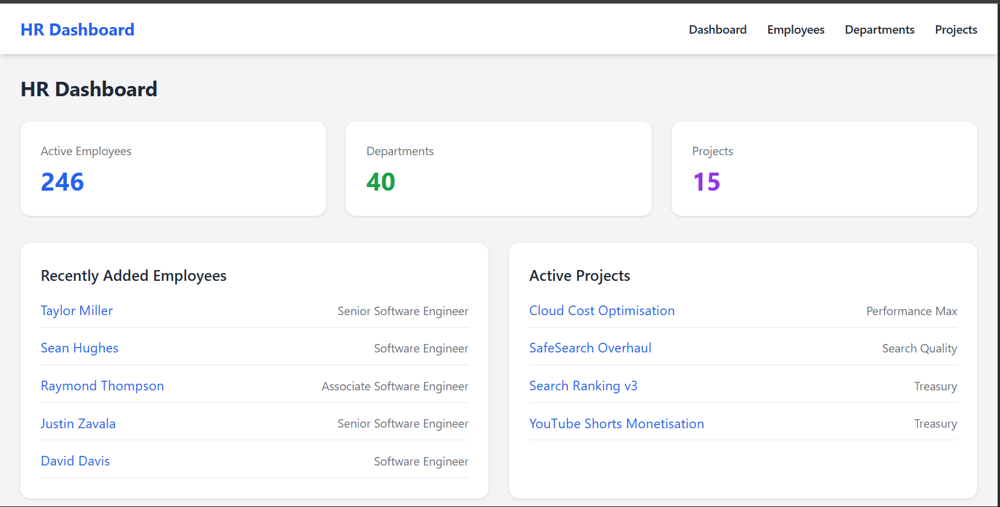
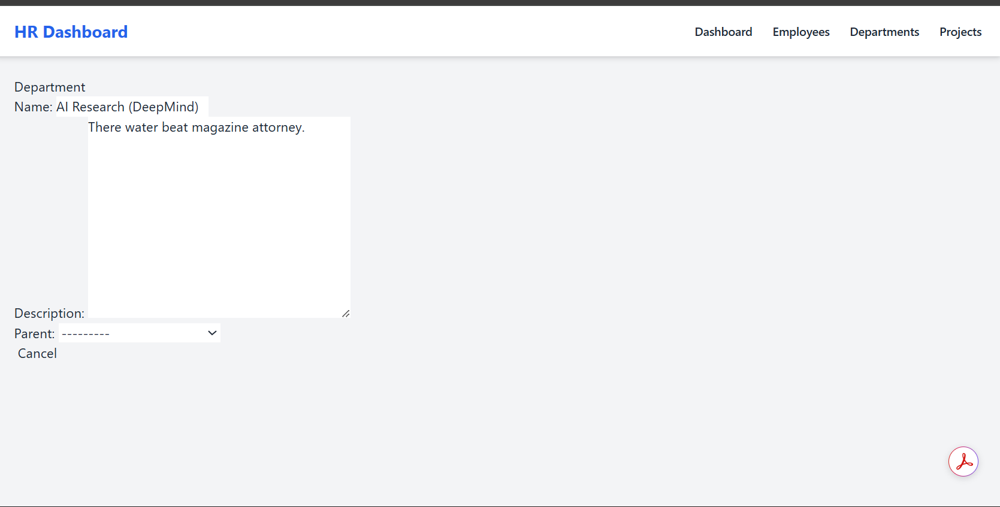
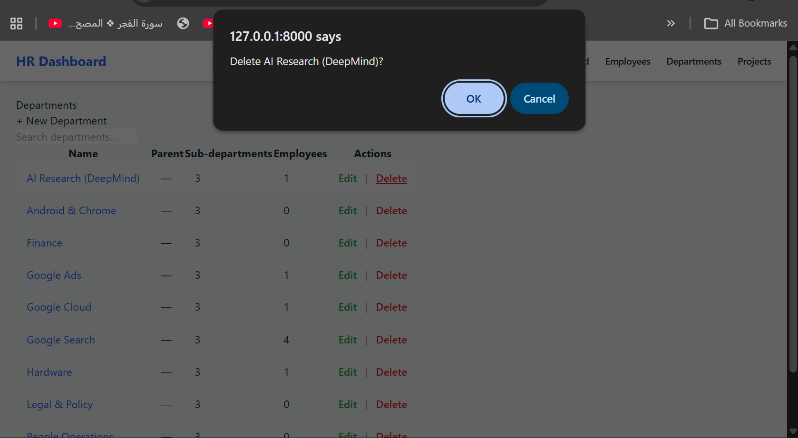
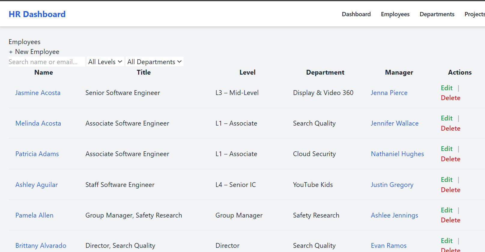
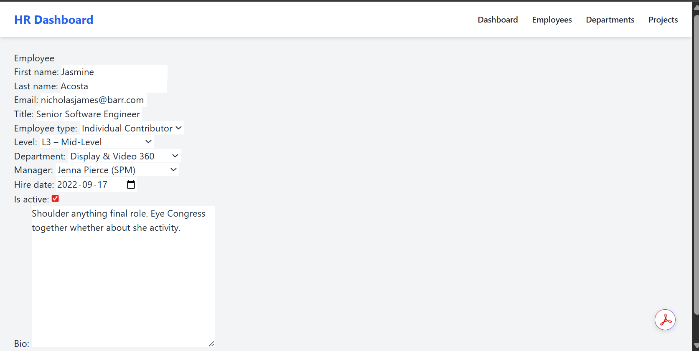
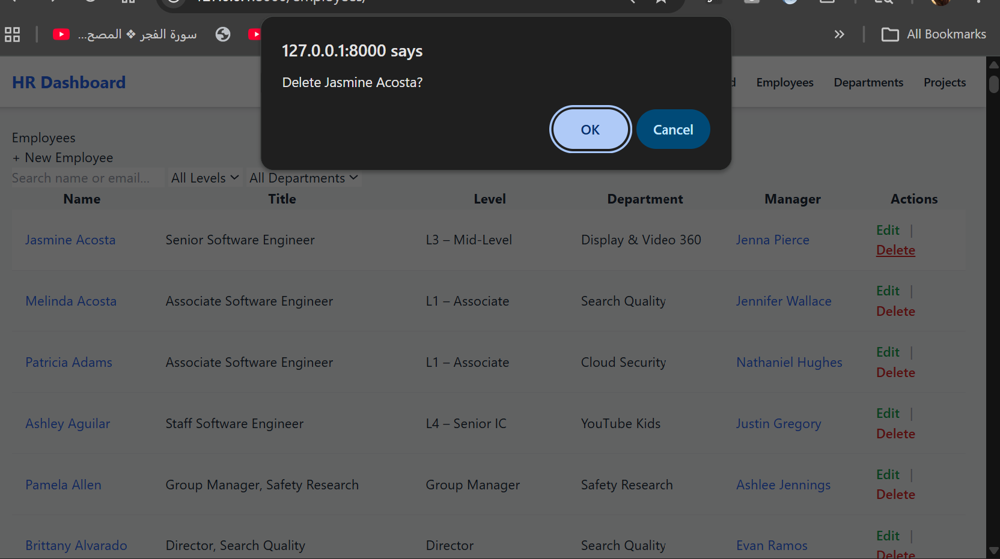
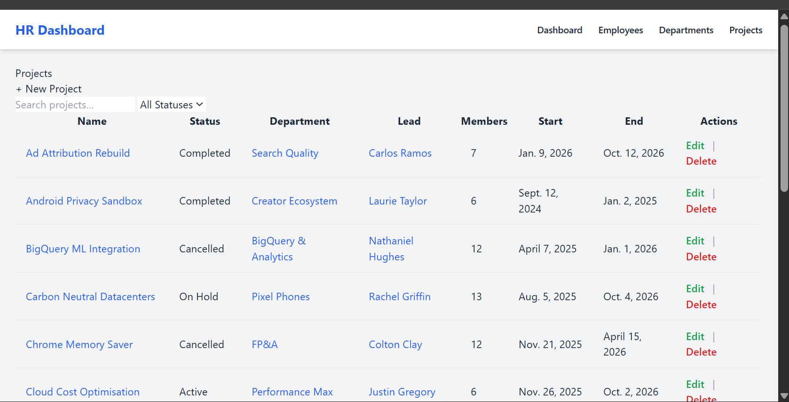
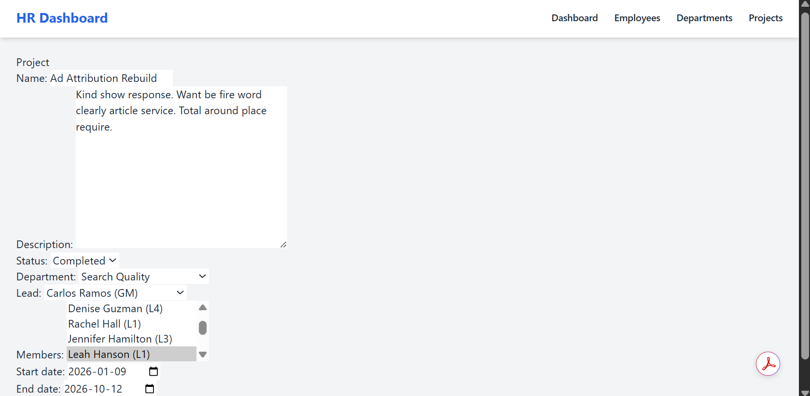
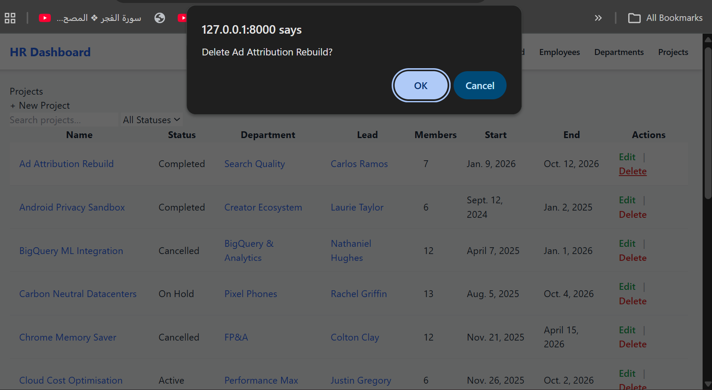

#  HR Management System (HRMS)

A modern HR Management System built with **Django + HTMX** for dynamic and smooth user interactions without full page reloads.
##  Project Overview

This project is a full-stack **HR Management System (HRMS)** built using **Django and HTMX**, designed to simulate real-world HR operations in a company environment.

The system allows users to manage employees, departments, and projects through a clean and intuitive interface. It focuses on implementing core business logic such as hierarchical departments, employee-manager relationships, and project assignments.

Unlike traditional Django apps that rely on full page reloads, this project integrates **HTMX** to enable smoother interactions — such as deleting records instantly without refreshing the page — improving the overall user experience.

---

##  Purpose

The goal of this project is to:

* Practice building a structured Django application using **Class-Based Views (CBVs)**
* Implement complete **CRUD operations** across multiple related models
* Understand relational data (ForeignKey, Many-to-Many)
* Improve frontend usability using **HTMX**
* Create a **portfolio-ready project** demonstrating both backend and UI skills

---

##  Key Concepts Implemented

* Employee hierarchy (manager → direct reports)
* Department structure (parent & sub-departments)
* Project management (lead + team members)
* Dynamic UI updates using HTMX
* Reusable templates and partials
* Clean separation of concerns (models, views, templates)

---

##  Why HTMX?

HTMX allows this project to behave like a modern web app without heavy JavaScript frameworks.

For example:

* Deleting an employee or project happens instantly
* No full page reload required
* Simpler code compared to React/Vue

This keeps the project lightweight while still delivering a smooth UX.

---

##  Architecture

The application follows Django best practices:

* Models → handle data structure and relationships
* Views (CBVs) → handle logic and data flow
* Templates → handle UI rendering
* URLs → map routes cleanly

---

##  What This Project Demonstrates

* Ability to build a real-world system from scratch
* Strong understanding of Django architecture
* Clean UI structuring and usability thinking
* Integration of modern tools like HTMX
* Problem-solving and debugging skills

---

##  Future Improvements

* Authentication system (Admin / HR roles)
* Pagination and advanced filtering
* REST API (Django REST Framework)
* Charts and analytics dashboard
* Profile images and file uploads


---

##  Features

*  Dashboard with real-time stats
*  Employee management (CRUD)
*  Department hierarchy
*  Project management
*  Search & filtering
*  HTMX-powered delete (no reload)
*  Clean UI

---

##  Screenshots

###  Dashboard



---

###  Departments


---

###  Department Edit



---

###  Department Delete



---

###  Employees



---

###  Employee Edit



---

###  Employee Delete



---

###  Projects



---

###  Project Edit



---

###  Project Delete



---

##  Tech Stack

* **Backend:** Django (Python)
* **Frontend:** HTML + HTMX
* **Styling:** CSS / Tailwind-style
* **Database:** SQLite

---

## ⚙️ Installation

### 1️ Clone the repository

```bash
git clone https://github.com/your-username/hrms_project.git
cd hrms_project
```

---

### 2️ Create virtual environment

```bash
python -m venv venv
```

Activate:

**Windows**

```bash
venv\Scripts\activate
```

**Mac/Linux**

```bash
source venv/bin/activate
```

---

### 3️ Install dependencies

```bash
pip install django
```

---

### 4️ Run migrations

```bash
python manage.py migrate
```

---

### 5️ Seed data (optional)

```bash
python seed_data.py
```

---

### 6️ Run server

```bash
python manage.py runserver
```

---

### 7️ Open browser

```
http://127.0.0.1:8000/
```

---

##  HTMX Example

```html
<button
  hx-delete=""
  hx-confirm="Delete {{ emp.full_name }}?"
  hx-target="body"
>
  Delete
</button>
```

✔ No reload
✔ Smooth UX

---

##  Project Structure

```
hrms_project/
│
├── assets/
│   ├── Dashboard.png
│   ├── Department.png
│   ├── Department_edit.png
│   ├── Department_delete.png
│   ├── employees.png
│   ├── employees_edit.png
│   ├── employees_delete.png
│   ├── projects.png
│   ├── project_edit.png
│   ├── project_delete.png
│
├── hrms/
├── hrms_project/
├── manage.py
├── seed_data.py
└── db.sqlite3
```

---

##  Author

**Hala Korayem**
UX/UI Designer & Developer

---

##  About

This project demonstrates:

* Django CBVs
* CRUD operations
* HTMX integration
* Clean UI structure
